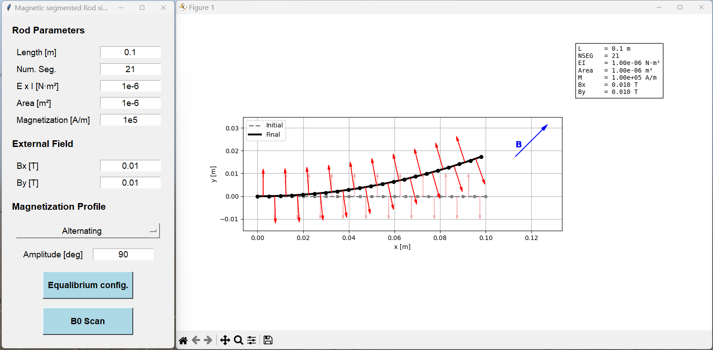
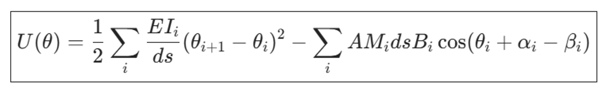

# MagneticRod2D

A Python simulator for 2D segmented magnetic rods subjected to external magnetic fields.

The simulator combines a graphical user interface for interactive exploration with analysis tools for systematic magnetic field sweeps.



*Figure 1. Interactive GUI for configuring rod properties, magnetization profiles, and magnetic fields.*

The rod is modeled as a chain of inextensible elastic segments with programmed magnetization. Given an external magnetic field, the static equilibrium configuration is obtained by minimizing the total energy, which consists of elastic bending energy and magnetic energy.

The project was created as a tool for studying magnetically actuated rods, soft robotic structures, and programmable magnetic materials.

---

## Model Assumptions

Current implementation:

- Two-dimensional deformation
- Inextensible rod
- Static equilibrium
- Clamped base
- Prescribed magnetization
- No dynamics
- No self-contact
- No dipole-dipole interactions

---

## Energy Formulation and Optimization

The equilibrium configuration is obtained by minimizing the total rod energy



where

$$
U(\theta)
=
\frac{1}{2}
\sum_i
\frac{EI_i}{ds}
(\theta_{i+1}-\theta_i)^2
-
\sum_i
A M_i ds B_i
\cos(\theta_i+\alpha_i-\beta_i)
$$

The first term represents the elastic bending energy and penalizes curvature along the rod.

The second term represents the magnetic potential energy and favors alignment between the local magnetization direction and the external magnetic field.

### Variables

| Symbol | Description |
|----------|-------------|
| \(U\) | Total energy |
| \(\theta_i\) | Orientation of segment *i* |
| \(EI_i\) | Bending stiffness of segment *i* |
| \(ds\) | Segment length |
| \(A\) | Rod cross-sectional area |
| \(M_i\) | Magnetization magnitude of segment *i* |
| \(B_i\) | Magnetic field magnitude at segment *i* |
| \(\alpha_i\) | Programmed magnetization angle relative to the local rod frame |
| \(\beta_i\) | Magnetic field direction |
| \(i\) | Segment index |

### Optimization

The base orientation is fixed (clamped boundary condition), and the remaining segment angles are treated as optimization variables.

The equilibrium configuration is computed by minimizing the total energy with the **BFGS (Broyden-Fletcher-Goldfarb-Shanno)** algorithm implemented in SciPy:

```python
scipy.optimize.minimize(
    objective,
    theta_free_initial,
    method="BFGS"
)
```


## Usage

The simulator can be operated in two ways.

### Graphical User Interface

Launch the interactive GUI:

```bash
python mainRunGUI.py
```

### Python Script

A simple example demonstrating direct use of the simulation classes is provided in:

```text
basic_example_NoGUI.py
```

---

## Graphical User Interface

The GUI (`RodGUI.py`) allows the user to configure:

### Rod Parameters

- Rod length
- Number of segments
- Bending stiffness (E × I, where E is Young's modulus and I is the second moment of area)
- Rod cross-sectional area
- Maximum magnetization magnitude

### External Magnetic Field

- Bx field component
- By field component

### Magnetization Profiles

- **Fixed profile**  
  Constant magnetization direction along the entire rod.

- **Alternating profile**  
  Magnetization direction alternates between neighboring segments.

- **Helical profile**  
  Magnetization direction rotates continuously along the rod length.

- **Sinusoidal profile**  
  Magnetization magnitude varies sinusoidally along the rod length, creating alternating magnetic domains with smoothly varying strength.

User-controlled profile parameters include:

- Magnetization angle
- Alternation amplitude
- Number of helix turns
- Number of sinusoidal periods

### Analysis Modes

#### Single Equilibrium Configuration

Compute the equilibrium rod shape for a specified magnetic field.

**Outputs:**

- Initial and equilibrium rod shapes
- Magnetization distribution
- Applied magnetic field direction
- Tip position and orientation

#### B0 Field-Angle Scan

Rotate the field through 360° and analyze rod behavior as a function of field direction.

**Important:** Each field angle is solved starting from the **same initial rod configuration**, allowing direct comparison of responses to different field directions.

**Outputs:**

- Tip workspace (reachable tip positions)
- Tip angle versus field angle
- Reachable-direction histogram
- Bending energy versus field angle
- Magnetic energy versus field angle

---

## Repository Structure

```text
mainRunGUI.py         Program entry point
RodGUI.py             Graphical user interface
MagneticField2D.py    Magnetic field model
MagneticRod2D.py      Rod model and equilibrium solver
RodState.py           Rod state variables
plotRod.py            Rod visualization
rodAnalysis.py        Field-angle scan analysis
ToolTip.py            GUI tooltips
```

---

## Requirements

- Python 3.10+
- NumPy
- SciPy
- Matplotlib
- tqdm
- Tkinter

Install dependencies:

```bash
pip install -r requirements.txt
```

---

## Running

Clone the repository:

```bash
git clone <repository-url>
cd MagneticRod2D
```

Launch the GUI:

```bash
python mainRunGUI.py
```

---

## Typical Applications

- Research prototyping
- Magnetic soft robotics
- Magnetically steerable devices
- Flexible magnetic structures
- Educational demonstrations

---

## Project Status

This project is under active development.

Future extensions may include:

- Field gradients
- Dipole interactions
- Dynamic simulations

---

## License

This project is licensed under the MIT License. See the LICENSE file for details.

---

## Author

Dr. Yair Goldfarb